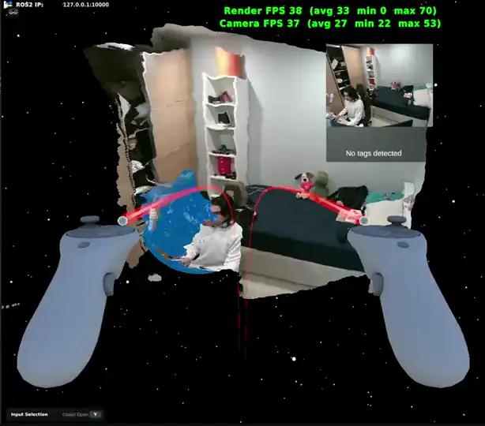
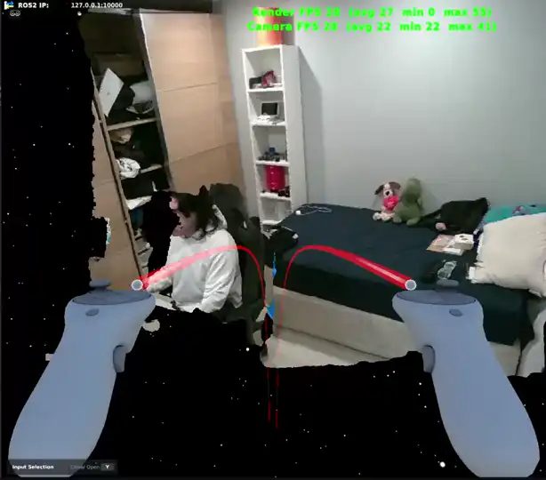
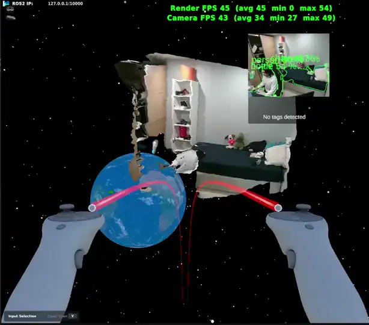
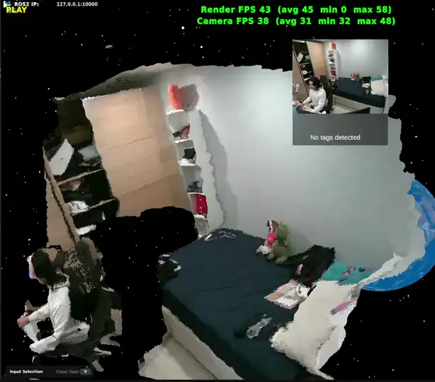
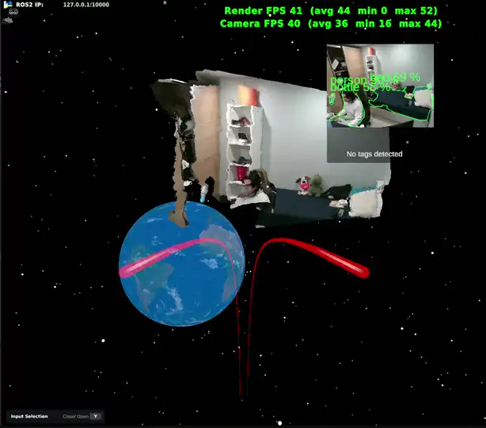
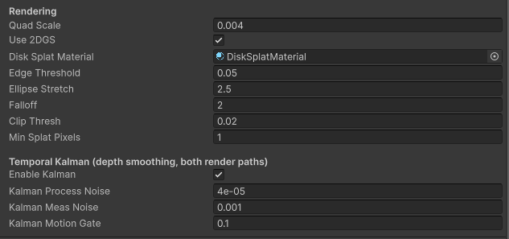

# 2D Gaussian Surfel Splatting (Unity)

A method for rendering a live RGB-D point cloud in Unity as oriented Gaussian disks (surfels)
rather than points. Each depth pixel is drawn as a small disk lying on the local surface, which
fills the inter-point gaps and gives a more continuous surface than a raw point cloud.

This repository documents the approach and results; the source is not published.

### Motivation

Streamed point clouds become sparse at close range and oblique viewing angles: the points
separate and the surface reads as gaps. Replacing each point with a surface-aligned disk covers
those gaps, so the surface stays continuous from off-axis viewpoints where a plain point stream
degrades.

### Scope

Surfel splatting in the classical (EWA) sense. Each splat is a flat 2D Gaussian on the surface,
derived directly from the depth and colour frames.

This is not the trained 2DGS / 3DGS used for novel-view synthesis: nothing is optimised, there
is no network and no spherical harmonics. Position, size, orientation and colour are taken from
the sensor data. "2D" refers to the planar disk primitive, as opposed to a volumetric 3D
Gaussian.

## Pipeline

Three stages, all GPU-side (no per-frame CPU readback).

**1. Ingest.** Depth and colour frames are uploaded to GPU textures; camera intrinsics are
passed in.

**2. Depth to surfels (compute shader).**
- **Kalman filter:** per-pixel temporal smoothing of depth; stable when static, reset on motion
  to avoid smearing.
- **Back-projection:** depth to a 3D position.
- **Normals:** finite differences over neighbouring points.
- **Edge detection:** depth discontinuities are billboarded toward the camera rather than
  stretched across the gap.
- **Tangent + anisotropy:** per-axis disk stretch and orientation from the local surface.

**3. Rasterise (vertex + fragment shader).** Each point is expanded to a quad, oriented to the
surface and stretched into an ellipse, with a Gaussian falloff. Rendered opaque with overlaps
resolved by the depth buffer — no per-frame sorting, no transparency ordering — and MSAA on
edges.

Two modes are provided: the oriented disks, and plain camera-facing quads as a baseline.

## Results

A pre-planned route was recorded and replayed for each stream to keep the viewing path
consistent between runs. All settings were held constant; only the feature under test was
enabled/disabled. Object detection was CPU-bound throughout (no GPU/OpenVINO), so that overhead
is included in its figures.

Clips are 2x speed and loop.

### Base point cloud

**No Kalman**

**Kalman**

**Kalman + object detection**

### 2D Gaussian surfel splatting

**No Kalman**

**Kalman**

**Kalman + object detection**

### Settings

