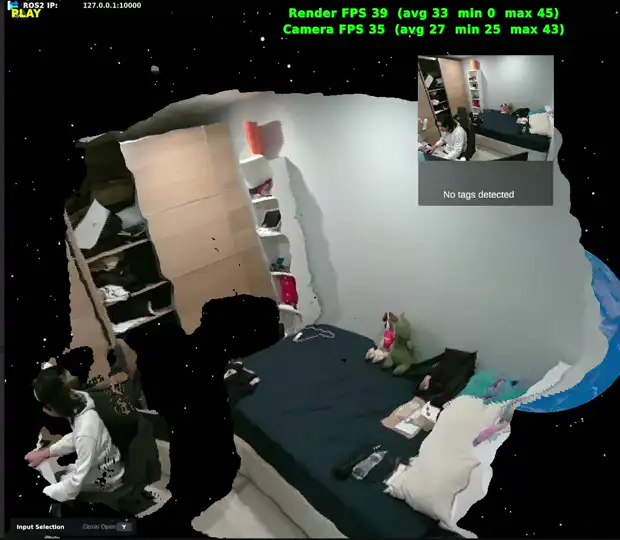

# 2D Gaussian Surfel Splatting (Unity)

A method for rendering a live RGB-D point cloud in Unity as oriented Gaussian disks (surfels)
rather than points. Each depth pixel is drawn as a small disk lying on the local surface, which
fills the inter-point gaps and gives a more continuous surface than a raw point cloud.

This repository documents the approach and results; the source is not published.

### Motivation

Streamed point clouds become sparse at close range and oblique viewing angles: the points
separate and the surface reads as gaps. Replacing each point with a surface-aligned disk covers
those gaps, so the surface stays continuous from off-axis viewpoints where a plain point stream
degrades.

### Scope

Surfel splatting in the classical (EWA) sense. Each splat is a flat 2D Gaussian on the surface,
derived directly from the depth and colour frames.

This is not the trained 2DGS / 3DGS used for novel-view synthesis: nothing is optimised, there
is no network and no spherical harmonics. Position, size, orientation and colour are taken from
the sensor data. "2D" refers to the planar disk primitive, as opposed to a volumetric 3D
Gaussian.

## Pipeline

Three stages, all GPU-side (no per-frame CPU readback).

**1. Ingest.** Depth and colour frames are uploaded to GPU textures; camera intrinsics are
passed in.

**2. Depth to surfels (compute shader).**
- **Kalman filter:** per-pixel temporal smoothing of depth; stable when static, reset on motion
  to avoid smearing.
- **Back-projection:** depth to a 3D position.
- **Normals:** finite differences over neighbouring points.
- **Edge detection:** depth discontinuities are given a fixed forward-facing normal (flattened
  to a billboard) rather than tilted across the gap.
- **Tangent + anisotropy:** per-axis disk stretch and orientation from the local surface.

**3. Rasterise (vertex + fragment shader).** Each point is expanded to a quad, oriented to the
surface and stretched into an ellipse, with a Gaussian falloff. Rendered opaque with overlaps
resolved by the depth buffer (no per-frame sorting, no transparency ordering), with MSAA on
edges.

Two modes are provided: the surface-oriented disks above, and a simpler baseline that draws each
point as a flat quad, either camera-facing (a billboard, always facing the viewer) or offset in
the sensor image plane (which foreshortens edge-on).

## Results

A pre-planned route was recorded and replayed for each stream to keep the viewing path
consistent between runs. All settings were held constant; only the feature under test was
enabled/disabled. Object detection was CPU-bound throughout (no GPU/OpenVINO), so that overhead
is included in its figures.

Three primitives are compared: a flat image-plane quad (the naive baseline), surface-oriented
2D Gaussian surfels, and a camera-facing billboard.

The flat quad foreshortens at oblique angles and leaves visible gaps up close and side-on. Both
the surfels and the billboard remove this. The surfels run at roughly 30 to 45 render fps; the
billboard is comparable (about 30 to 40) and, in these scenes, looks as good or better while
being far simpler. The flat quad is faster (40 to 60) only by doing and showing less.

In short, orienting splats to the surface did not visibly help here over a view-facing
billboard: the surfels' theoretical advantages (correct occlusion, anisotropic fill on grazing
surfaces) were not significant in this streaming RGB-D setting, and they cost more and add some
temporal instability. The billboard figures are also unoptimised (it still renders in a
transparent, depth-write-off pass), so it could be made faster still.

The camera stream rate is unchanged across modes, as expected (sensor-bound, not render-bound).
All clips loop. The 2D Gaussian (Kalman) and billboard clips play at 1x; the other clips are
1.5x. The billboard was captured with the Kalman filter only.

### Billboard vs 2D Gaussian (Kalman)

<table width="100%">
<tr>
<td width="50%" align="center"><b>Camera-facing billboard</b> </td>
<td width="50%" align="center"><b>2D Gaussian surfels</b> </td>
</tr>
</table>

### Flat image-plane quad (naive baseline)

**No Kalman**

**Kalman**

**Kalman + object detection**

### 2D Gaussian surfel splatting

**No Kalman**

**Kalman**

**Kalman + object detection**

### Camera-facing billboard

**Kalman**

### Settings

